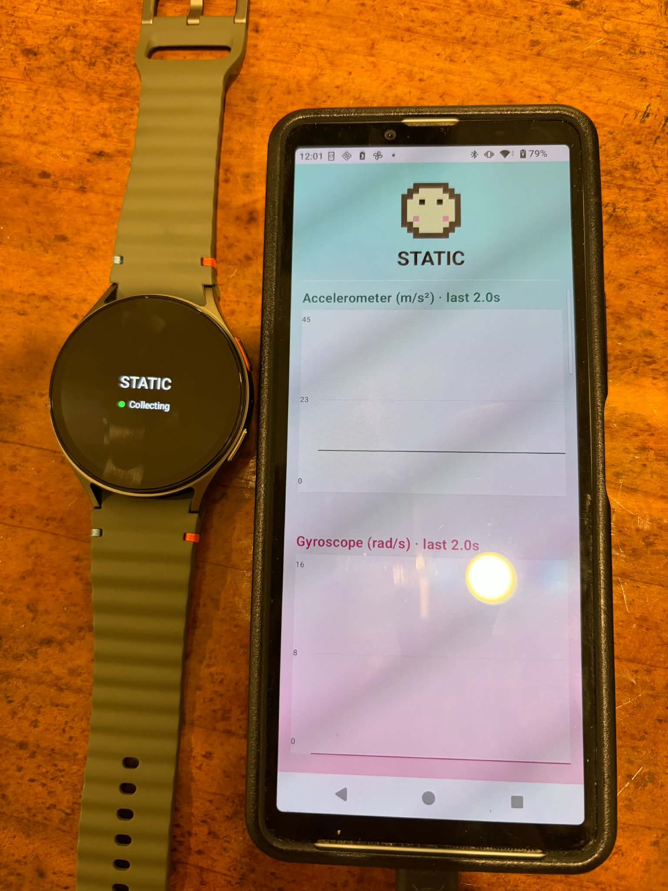

# SensorFlow: Wear OS & Mobile Motion Analysis App

SensorFlow is a distributed Android application that performs real-time motion classification using data streamed from a Wear OS device to a mobile companion app. This project demonstrates a complete data pipeline: from hardware sensor acquisition and low-latency network transmission to signal processing and heuristic-based classification.

## 📺 Demo

### Device Pairing

*Figure 1: Demonstration of the seamless connection between the Wear OS device and the handheld mobile app.*

### Real-time Classification
<video src="media/demo.mp4" width="100%" controls>
  Your browser does not support the video tag.
</video>
*Video 1: Real-time classification of the four motion states (Static, Tap, Shake, and Walk) as performed on the watch and reflected on the phone UI.*

---

## 🚀 Project Overview

The goal of this project is to accurately classify four distinct human activities—**Static, Tap, Shake, and Walk**—using a smartwatch's IMU sensors.

- **Wear OS**: Captures Accelerometer and Gyroscope data at 100Hz and streams batched samples.
- **Mobile App**: Receives data via the Wearable Data Layer API, performs signal conditioning, extracts 14 time-domain features, and classifies motion in real-time.
- **UI/UX**: Features live scrolling magnitude charts, connection status heartbeats, and reactive pixel-art animations representing the classified state.

---

## 🏗️ Technical Architecture

### 1. Data Transmission (Wearable Data Layer)
I chose the **MessageClient** API for its low-latency characteristics. To ensure efficiency:
- **Custom Serialization**: Developed a custom `ByteBuffer` wire format to pack multiple `SensorSample` objects into a single payload, minimizing transmission overhead.
- **Congestion Control**: Implemented a mutex-guarded, non-blocking send mechanism on the watch. This prevents "backlog spikes" by dropping new batches if the Bluetooth link is temporarily saturated, ensuring the UI always reflects the most recent data.

### 2. Signal Processing Pipeline
Once the data reaches the phone, it undergoes a multi-stage pipeline:
- **Rolling Window**: A 2-second sliding window managed by sample timestamps (rather than arrival time) to ensure temporal consistency.
- **Magnitude Calculation**: Converted X/Y/Z axes into **Vector Magnitude** ($\sqrt{x^2+y^2+z^2}$) to achieve **Rotation Invariance**. This allows classification to remain accurate regardless of how the watch is oriented or which hand it's worn on.
- **Outlier Rejection**: A physical-plausibility filter (±20g / ±2000°/s) strips hardware glitches before they contaminate statistical features.

### 3. Feature Engineering & Classification
Instead of a simple threshold-only approach, I implemented a **Nearest Centroid Classifier** using 14 Z-normalized features (7 from Accel, 7 from Gyro):
- **Key Features**: Mean, StdDev, Peak-to-Peak, Zero-Crossing, Energy, Max Jerk, and **Crossing Interval CV**.
- **Innovation**: The *Crossing Interval CV* (Coefficient of Variation) was specifically added to distinguish between rhythmic motion (Walk) and chaotic motion (Shake), significantly improving Walk recall from 68% to 97%.
- **Normalization**: To prevent the high-energy "Shake" state from compressing the feature space of other states, the normalization parameters were calculated excluding Shake data, treating it as a distant outlier in the Z-space.

---

## 🧠 Development Process & AI Collaboration

This project was developed with the assistance of an AI coding partner (Claude). As the lead developer, I made all core architectural and data-science decisions, including:
- **Tool Selection**: Choosing `DataLayer API` for transport and `SensorManager` for acquisition.
- **Algorithm Design**: Designing the nearest-centroid classification logic and the specific feature set used.
- **Iterative Debugging**: Identifying that "stalls" were caused by Main Thread contention and moving processing to `Dispatchers.Default`.
- **Methodology**: Setting up a CSV-based "Recording Mode" to collect labeled data, which I then used to calibrate the classifier's centroids.

---

## 🛠️ Tech Stack
- **Languages**: Kotlin (100%)
- **UI**: Jetpack Compose (Mobile & Wear OS)
- **Concurrency**: Kotlin Coroutines & Flow
- **API**: Wearable Data Layer, SensorManager
- **Build System**: Gradle Version Catalog, Kotlin DSL

## 📈 Future Improvements
- **"Look at Watch" Gesture**: Adding Raw Axis Mean features to detect wrist tilt relative to gravity.
- **ML Integration**: Transitioning from a Centroid-based approach to a lightweight TensorFlow Lite model trained on a larger dataset.
- **Background Support**: Implementing a `WearableListenerService` for background activity monitoring.

---
*Created as part of a technical assignment to demonstrate end-to-end data processing capabilities.*
